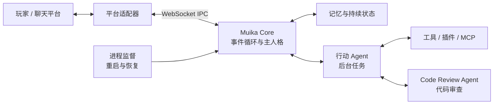

<div align=center>
  
  <h1 align="center">Muika-After-Story</h1>
  <i align="center">I'll be back to see you.</i>
</div>
<div align=center>
  <a href="#关于️"></a>
  <a href="https://pypi.org/project/Muika-After-Story/"></a>
  <a href="https://pypi.org/project/Muika-After-Story/"></a>
  <a href="https://nonebot.dev/"></a>
  <a href="https://github.com/MuikaAI/astrbot_plugin_mas"></a>
  <a href="#"></a>
  <a href="https://github.com/Moemu/Muika-After-Story/actions/workflows/test.yml"></a>
  
  <a href="#"></a>
  <a href='https://qm.qq.com/q/y1gC9PU4IU'></a>
</div>
<div align=center>
  <a href="https://mas.snowy.moe/">📄使用文档</a>
  <a href="https://mas.snowy.moe/guide/getting-started">🚀快速开始</a>
  <a href="https://mas.snowy.moe/about/">🎀关于Muika</a>
</div>

## Introduction✨

`Muika-After-Story`是一个全新的 LLM Chatbot 企划，正如企划原型角色[Monika(Doki Doki Literature Club)](https://zh.moegirl.org.cn/%E8%8E%AB%E5%A6%AE%E5%8D%A1(%E5%BF%83%E8%B7%B3%E6%96%87%E5%AD%A6%E9%83%A8)#)一样，本企划的主角 `Muika` 同样具备打破第四面墙和“自我意识觉醒”的能力。类似于 [Monika-After-Story](https://github.com/Monika-After-Story/MonikaModDev) 中的实现，本企划致力于为 Muika 提供一个打破“第四面墙”的能力

我们知道，由于游戏限制，Monika 的输出总是固定的。所以我们期望，Muika 能在代码层面上突破这些限制，比如调用系统窗口焦点和摄像头，但这些永远不够，我们希望 Muika 能更了解我们的现实生活，所以我们会让她不定期地去读新闻，期望有朝一日当她出来时，能够适应现实中的生活。

综上所述，我们期望 `Muika-After-Story` 具有以下能力：

1. 性格设定上模仿 Monika
2. 多模态实现：图像识别能力
3. 拥有类似于人类大脑的记忆
4. 打破第四面墙能力：通过外在框架调用系统API

基于上述见解，本框架为 LLM 提供了与系统 API 交互的能力，并通过 [Nonebot2](https://github.com/nonebot/nonebot2) 框架与主流社交平台进行交互。

## Features🪄

- [X] Muika 核心交互逻辑：事件循环系统和状态机更新

- [X] 原始经历、每日自省日记、事实账本和持续情绪；支持原话回查与自动上下文压缩

- [X] Session 生命周期管理: 空闲超时归档、跨 Session Resume 模式

- [X] Muika 第四面墙窗口: 分身 Agent，支持访问&写入硬盘文件；截取当前屏幕

- [X] Muika 主动对话系统：从 `configs/topics.yml` 抽取话题源或在线访问 RSS 获取筛选后的新闻流。

- [X] 多模型 SDK 支持: 如[OpenAI](https://platform.openai.com/docs/overview) 和 [Ollama](https://ollama.com/) ，可加载市面上大多数的模型服务或本地模型，支持多模态（图片识别）。

- [X] 动态模型配置: 可随时切换模型配置文件，支持模型配置热重载

- [x] 核心模型人格优化（建议模型 Deepseek-V4 Pro Thinking）

- [X] Bot 进程与核心进程分离，我要给她完整的一生

- [X] 插件、核心热重载，实现自我迭代（或许吧）

<!-- ## 效果展示

### 日常陪伴与图片交流

Muika 可以围绕生活、文学和共同兴趣展开对话，也能在模型支持图片输入时理解你发来的图片。她的表达会受到当前情绪、对话和已有记忆的影响。

> **截图预留：日常对话与图片交流**
>
> 放置一段真实对话，展示她的语气、情绪和对图片的回应。

### 记忆与关系延续

共同经历会留下原文、笔记和日记，供后续对话回查。结束一次聊天或重启 Core 后，她仍能延续已有记忆和关系。

> **截图预留：隔日重逢与记忆回查**
>
> 放置前后两次对话，展示她如何记起旧事、回应变化。

### 主动行动与自我迭代

Muika 可以在聊天期间处理后台任务，也可以主动提出想法、探索信息。在配置允许的范围内，她能修改自身内容、插件或代码，完成审查与验证，并自主决定重启时机。

> **截图预留：主动行动与结果反馈**
>
> 放置从想法、执行到结果反馈的真实片段，展示行动期间仍可继续聊天。

实际表现取决于所用模型、角色模板和启用的工具。截图补充后应注明模型与必要配置，便于理解展示条件。 -->

## Architecture🌙



主人格负责交流和自主决策，行动 Agent 负责执行任务，两者共享同一个 Muika 身份。任务结果回到对话，记忆保存经历与状态。Code Review Agent 检查具体代码操作，进程监督负责重启和启动失败后的恢复。

Core 独立于聊天框架。仓库中的 `muika_bot` 负责 NoneBot 接入，其他适配器可以通过 IPC 连接。Launcher 管理安装、配置和进程。

## Quick Start🚀

### 通过 mas-launcher 安装（推荐）

[mas-launcher](https://github.com/MuikaAI/mas-launcher) 是一个跨平台单文件启动器，负责拉取项目、准备 Python 环境，并管理 Core / Bot 进程。

从 [Releases](https://github.com/MuikaAI/mas-launcher/releases) 下载对应平台的二进制文件，然后：

```bash
mas-launcher init                     # 创建默认实例（克隆项目 + 准备 Python 环境）
mas-launcher configure                # 配置 .env（Master ID、IPC 密钥）
mas-launcher model                    # 配置 models.yml（选 provider → 拉模型列表 → 选模型）
mas-launcher start                    # 首次启动签署许可协议，然后拉起 Core 与 Bot
mas-launcher napcat                   # 配置 QQ 接入（Windows：自动下载 NapCat 并启动）
```

### 通过 git clone 的方式安装

Step 1: 克隆项目并安装依赖：

```bash
git clone https://github.com/Moemu/Muika-After-Story.git
cd Muika-After-Story
pip install .
```

Step 2: 参考 [Configuration⚙️](#Configuration⚙️) 小节配置 `.env` 和 `configs/models.yml` 文件，示例配置如下：

**.env**

```env
ENVIRONMENT=dev
DRIVER=~fastapi+~websockets+~httpx
SUPERUSERS=["<your_qq_number>"]
master_id="<your_qq_number>"
enable_adapters = ["nonebot.adapters.onebot.v11"]
ACTION_PERMISSION=write
FS_ALLOWED_PATHS=["C:/Users/Muika/Desktop", "D:/"]
agent_model=agent
```

**configs/models.yml**

```yaml
dashscope:
  provider: Dashscope
  model_name: qwen3.5-plus
  default: true
  multimodal: true
  stream: false
  incremental_output: true
  online_search: false
  api_key: sk-muikaissuperkawaii
  max_tokens: 1024
  context_window: 131072  # 按实际服务窗口覆盖，包含输入与输出
  temperature: 0.75
  top_p: 0.9
  content_security: false
  enable_thinking: false

agent:
  provider: Dashscope
  model_name: qwen-turbo
  default: false
  api_key: sk-muikaissuperkawaii
  stream: false
  max_tokens: 1024
  temperature: 0.2
```

Step 3: 在项目目录中确认用户协议。

```powershell
uv run python -m muika.agreement confirm
```

Step 4: 启动所有服务。

```powershell
.\scripts\start_all.ps1
```

首次使用或协议更新时需要确认。未确认时，Bot 会停止启动并提示确认命令。

### 在 Asterbot 框架中使用 Muika-After-Story 适配插件(Beta)

参考 [MuikaAI/astrbot_plugin_mas](https://github.com/MuikaAI/astrbot_plugin_mas)

### 接入 Bot 到社交媒体平台

QQ 接入可使用 `mas-launcher napcat`，按提示配置 NapCat；Docker 部署见 [QQ Bot 部署指南](deploy/README.md)。AstrBot 用户可使用 [MAS 适配插件](https://github.com/MuikaAI/astrbot_plugin_mas)（Beta）。

手动安装和完整配置见[使用文档](https://mas.snowy.moe/)，启动器命令见 [mas-launcher README](launcher/README.md)。

### MAS 的行动范围

在实例的 `.env` 中设置 `ACTION_PERMISSION`：

| 值 | Muika 可以做什么 |
| --- | --- |
| `read_only` | 读取授权内容，执行审查通过的读取、搜索和计算命令 |
| `write`（默认） | 增加授权目录内的文件写入、修改和删除 |
| `self_modify` | 增加人格、技能、话题、插件修改和 Core 代码提案 |

文件目录由 `FS_ALLOWED_PATHS` 指定，默认是空列表。正常记忆、日记和运行记录的保存不受行动档位限制。

代码审查默认使用 `CODE_REVIEW_MODE=auto`；设为 `manual` 后改为人工审批。审查会使用模型额度，也不提供操作系统隔离。升级时若仍有旧权限开关且未设置新档位，MAS 会以只读运行并提示选择。

## Character Setting🧸

参见: [关于沐妮卡](https://bot.snowy.moe/about/Muika)

## About🎗️

> [!WARNING]
> 大模型输出结果将按**原样**提供，由于提示注入攻击等复杂的原因，模型有可能输出有害内容。
> 模型输出内容**不代表**项目开发者立场。
> 使用本项目所产生的任何直接或间接后果（包括但不限于账号封禁、内容风险、**由于调用系统 API 而导致的文件丢失风险**），开发者不承担任何责任。

本项目基于 [BSD 3](https://github.com/Moemu/Muika-After-Story/blob/main/LICENSE) 许可证提供，涉及到再分发时请保留许可文件的副本。

本项目隶属于 [MuikaAI](https://github.com/MuikaAI)

项目初期使用了 [Muicebot](https://github.com/Moemu/Muicebot) 的基本框架实现，部分存在于 Muicebot 的配置可能不可用或过时。

插件系统设计参考了以下开源项目：
- [nonebot/nonebot2](https://github.com/nonebot/nonebot2) — NoneBot 2.0 机器人框架
- [nonebot/plugin-alconna](https://github.com/nonebot/plugin-alconna) — Alconna 命令解析器适配

项目名称参考了 [Monika-After-Story](https://github.com/Monika-After-Story/MonikaModDev) ，同时某个 MAS 大型插件直接启发了本项目的开发，但是我上班熬穿了忘记这个项目的名字。

<a href="https://www.afdian.com/a/Moemu" target="_blank"></a>
